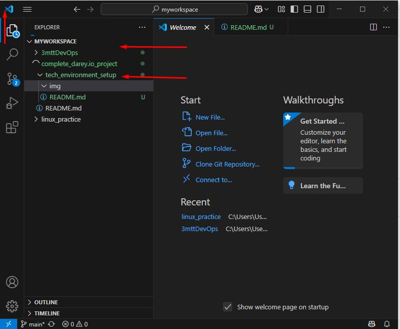
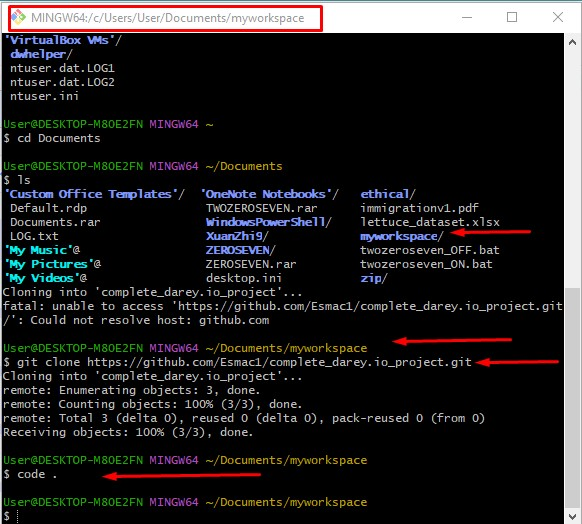
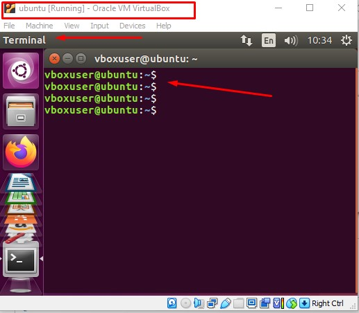
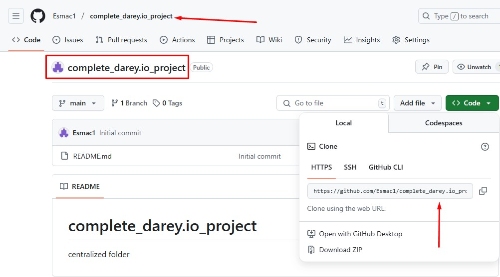

# Tech Environment Setup

## Tools needed to be installed

1. Visual Studio code(VSCode)

2. Git

3. Virtual Box

4. Ubuntu on Virtual box(Win/MAC)

## Account to be created
1. Github account

2. Amazon Web Services(AWS)
