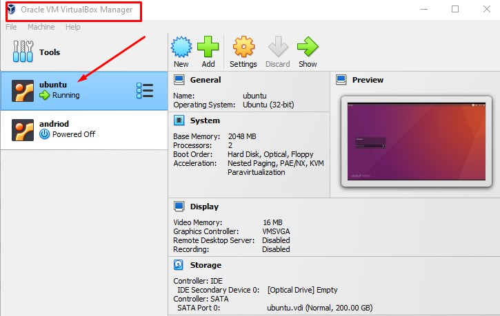

# Tech Environment Setup

## Tools needed to be installed
### This images uploaded and included here are valid as they have been pre-installed on the system before the tech-setup instruction project. 
1. ## Visual Studio code(VSCode)

2. ## GIT BASH

3. ## Virtual Box

4. ## Ubuntu on Virtual box(Win/MAC)

## Account to be created
1. ## Github account

2. ## Amazon Web Services(AWS)
